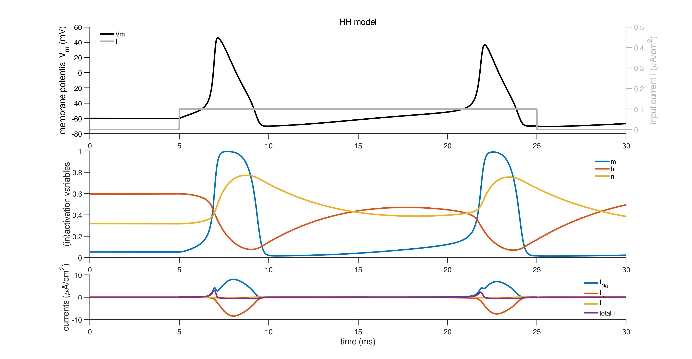
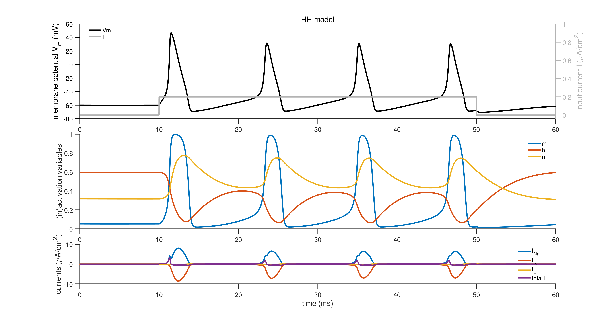
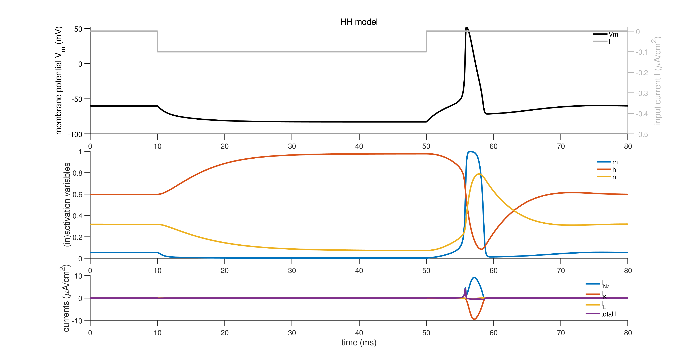

# Simulating the Hogkin-Huxley model using MATLAB, forward Euler method

## Description

- The equations and constants are taken from [link](https://www.math.mcgill.ca/gantumur/docs/reps/RyanSicilianoHH.pdf)(page 23)
- This is implemented using vanilla forward Euler method.

## Try-it-yourself

- Try changing the constants (the ones defined as `global`)
- Try playing around with these parameters:
  - `T` as max simulation time
  - `t_inp` as a 2-element vector signifying when to turn on current input
  - `I_amp` as input amplitude, try both negative and positive values

## Examples

- An example with positive input:

- Longer larger positive input:

- An example with negative input:

